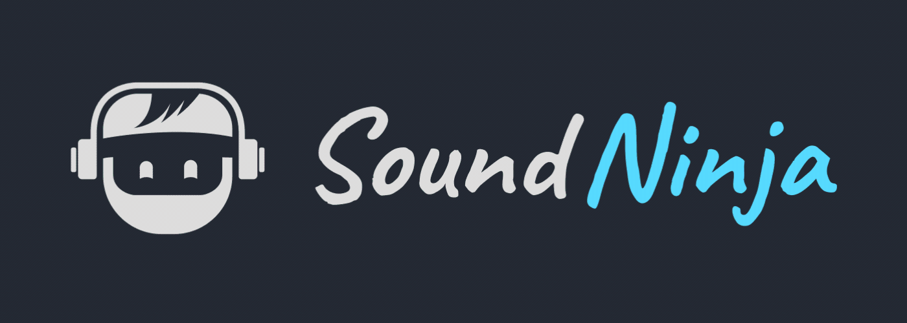

# Sound Ninja



Sound Ninja is an **Open Source Soundboard App** with maximal customizible option to create your best Soundboard. Perfect for **live streaming, chatting with friends or podcast recording**.

```diff
-   Its still in development and has still some heavy bugs and limitations but I working hard to fix them in the future.
```

## Project setup

```
npm install
```

### Compiles and hot-reloads for development

```
npm run serve
```

### Compiles and minifies for production

```
npm run build
```

### Lints and fixes files

```
npm run lint
```

### Customize configuration

See [Configuration Reference](https://cli.vuejs.org/config/).
