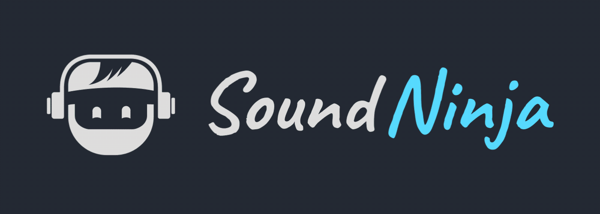

# Sound Ninja



<div align="center">


</div>
<b>Sound Ninja</b> is an <b>Open Source Soundboard App</b> with maximal customizability option to create your best Soundboard. Perfect for **live streaming, chatting with friends or podcast recording**. 😉👍

## How is the progress going?

```diff
-   Sound Ninja is still in development and is not ready for use!
```

The progress can be tracked on the [GitHub Project Board](https://github.com/users/marcus-universe/projects/1/views/1).

## Why Sound Ninja?

Sound Ninja is a **Open Source Soundboard App** with the goal to provide the maximal customizability options and a modern UI. Its build with **Tauri v2 and Nuxt 4** and doesn't take much space on your pc and ram not like other soundboard apps. The main reason was to create a Soundboard-App that lets you organize really efficiently your sounds to find them really fast and easy in the moment you need them and to have a better gui for VR experiences. On top, it gives everyone the option to share there soundboards with others to become together the biggest Meme-Loards of our time. 😎

## Features (+upcoming)

| Feature                      | Description                                               | Status |
| ---------------------------- | --------------------------------------------------------- | ------ |
| **Soundboard**               | Create your own Soundboard with your favorite sounds      | ✅     |
| **Tab System**               | Organize your sounds in Tabs                              | ✅     |
| **Searchbar**                | Find your sounds quick and easy                           | ✅     |
| **Themes**                   | Design your Soundboard how you like it                    | ✅     |
| **Custom Profiles**          | Create multiple Soundboards with different settings       | ✅     |
| **Tag System**               | Tag your favorite sounds in to cathegories                | ⛔     |
| **Midi Support**             | Control your Soundboard via Midi                          | ⛔     |
| **Customizable Hotkeys**     | Customize the Hotkeys to your needs                       | ⛔     |
| **Soundboard Sharing**       | Share your Soundboard with your friends                   | ⛔     |
| **Soundboard Import/Export** | Import and Export your Soundboard                         | ⛔     |
| **Websocket**                | Control your Soundboard with your Smartphone              | ⛔     |
| **Recorder**                 | Record your PC-Audio directly in Sound Ninja              | ⛔     |
| **Speech Search**            | Find sounds with the power of your voice                  | ⛔     |
| **Gifs & Images**            | Give your Sounds an Image/Gif                             | ⛔     |
| **Twitch Chat Control**      | Let your community decide what to play                    | ⛔     |
| **AI Assistant**             | Recommends you sounds that works in the current situation | ⛔     |

## Platforms

Sound Ninja currently supports theoretically the following platforms:

| Platform | Versions        |
| :------- | :-------------- |
| Windows  | 8 and above     |
| macOS    | 10.15 and above |
| Linux    | See below       |

**Linux Support**

- Debian (Ubuntu 18.04 and above or equivalent) with the following packages installed:
  - `libwebkit2gtk-4.0-37`, `libgtk-3-0`, `libayatana-appindicator3-1`<sup>1</sup>
- Arch with the following packages installed:
  - `webkit2gtk`, `gtk3`, `libayatana-appindicator`<sup>1</sup>
- Fedora (latest 2 versions) with the following packages installed:
  - `webkit2gtk3`, `gtk3`, `libappindicator-gtk3`<sup>1</sup>

```diff
-   Be aware that Sound Ninja is in a early development stage and so its not tested on all platforms yet.
```

## Project setup

Requires [Node.js](https://nodejs.org/) (for npm/pnpm) or [Bun](https://bun.sh/) / [Deno](https://deno.com/). Also needs the [Tauri prerequisites](https://v2.tauri.app/start/prerequisites/) for desktop builds.

Install dependencies with any of:

```bash
# bun (recommended)
bun install

# npm
npm install

# pnpm
pnpm install

# deno
deno install
```

### Available dependencies

- [Nuxt 4](https://nuxt.com/) (Vue 3)
- [Tauri v2](https://tauri.app/)
- [Pinia](https://pinia.vuejs.org/)
- [SASS](https://sass-lang.com/)
- [@nuxtjs/i18n](https://i18n.nuxtjs.org/)
- [SortableJS](https://sortablejs.github.io/Sortable/)

### Compiles and hot-reloads for development

```bash
bun run tauri:serve
# or: npm run tauri:serve / pnpm tauri:serve / deno task tauri:serve
```

### Compiles and minifies for production

```bash
bun run tauri:build
# or: npm run tauri:build / pnpm tauri:build / deno task tauri:build
```

### Frontend only (no Tauri shell)

```bash
bun run dev
# or: npm run dev / pnpm dev / deno task dev
```

### Customize configuration

See [Nuxt Configuration](https://nuxt.com/docs/api/configuration/nuxt-config) and [Tauri Configuration](https://v2.tauri.app/reference/config/).
