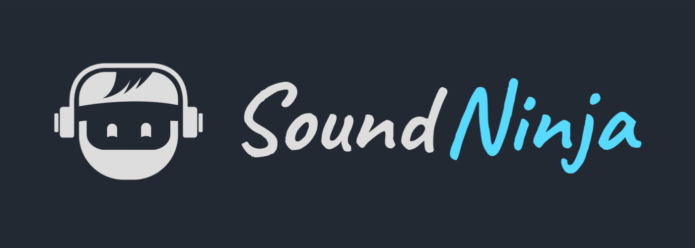

# Sound Ninja



<div align="center">


</div>
<b>Sound Ninja</b> is an <b>Open Source Soundboard App</b> with maximal customizability option to create your best Soundboard. Perfect for **live streaming, chatting with friends or podcast recording**. 😉👍


## 🥷 Why SoundNinja?
The core pillars of SoundNinja are high performance and deep customizability.

Most existing soundboard apps are difficult to read and clunky to control on small displays or inside VR environments. SoundNinja solves this by providing a highly accessible, customizable, and fully open-source solution designed to adapt to your specific setup.

### 🚀 Performance First
Built on the bleeding edge of **Tauri v2** and **Nuxt 4**, SoundNinja is incredibly lightweight. Unlike heavy alternative soundboard apps, it keeps its storage footprint tiny and stays ultra-lean on RAM usage.

### 🎯 Built for Speed & Spatial UI
The core mission was to build a soundboard that empowers you to organize massive libraries efficiently. Find the exact sound you need in milliseconds—right when you need it most. Plus, the interface is optimized to offer a seamless dashboard experience inside **VR environments**.


| Feature                      | Description                                               | Status |
| ---------------------------- | --------------------------------------------------------- | ------ |
| **Soundboard**               | Create your own Soundboard with your favorite sounds      | ✅     |
| **Tab System**               | Organize your sounds in Tabs                              | ✅     |
| **Searchbar**                | Find your sounds quick and easy                           | ✅     |
| **Themes**                   | Design your Soundboard how you like it                    | ✅     |
| **Custom Profiles**          | Create multiple Soundboards with different settings       | ✅     |
| **Recorder**                 | Record your PC-Audio directly in Sound Ninja              | ✅     |
| **Gifs & Images**            | Give your Sounds an Image/Gif                             | ✅     |
| **Customizable Hotkeys**     | Customize the Hotkeys to your needs                       | ✅     |
| **Companion Remote**         | Trigger sounds from Bitfocus Companion over HTTP/WebSocket | ✅     |
| **Soundboard Sharing**       | Share your Soundboard with your friends                   | ✅     |
| **Soundboard Import/Export** | Import and Export your Soundboard                         | ✅     |
| **Tag System**               | Tag your favorite sounds in to cathegories                | ⛔     |
| **Midi Support**             | Control your Soundboard via Midi                          | ⛔     |
| **Speech Search**            | Find sounds with the power of your voice                  | ⛔     |
| **Twitch Chat Control**      | Let your community decide what to play                    | ⛔     |
| **AI Assistant**             | Recommends you sounds that works in the current situation | ⛔     |

## Downloads


[](https://github.com/marcus-universe/SoundNinja/releases/latest/download/soundninja-windows-x64-setup.exe)
<br>
[](https://github.com/marcus-universe/SoundNinja/releases/latest/download/soundninja-macos-arm64.dmg)
[](https://github.com/marcus-universe/SoundNinja/releases/latest/download/soundninja-macos-x64.dmg)
<br>
[](https://github.com/marcus-universe/SoundNinja/releases/latest/download/soundninja-linux-amd64.deb)
[](https://github.com/marcus-universe/SoundNinja/releases/latest/download/soundninja-linux-amd64.AppImage)
<br>
[](https://github.com/marcus-universe/SoundNinja/releases/latest/download/companion-module-soundninja.tgz)

App installers and the Companion module `.tgz` both live on `/releases/latest/download/…`. The module is attached by the Companion Module action on the `companion-module` branch.

## Platforms

Official builds (x86_64 unless noted):

| Platform | Support |
| :------- | :------ |
| Windows 10+ | NSIS installer (WebView2) |
| macOS 10.15+ | DMG per architecture (Apple Silicon, Intel) |
| Linux x86_64 | `.deb` (Debian/Ubuntu, WebKitGTK 4.1) or AppImage. PipeWire or PulseAudio for sound. |

Early development — not tested on every distro.

## Project setup

Requires [Node.js](https://nodejs.org/) (for npm/pnpm) or [Bun](https://bun.sh/) / [Deno](https://deno.com/). Also needs the [Tauri prerequisites](https://v2.tauri.app/start/prerequisites/) for desktop builds.

Install dependencies with any of:

```bash
# bun (recommended)
bun install

# npm
npm install

# pnpm
pnpm install

# deno
deno install
```

### Available dependencies

- [Nuxt 4](https://nuxt.com/) (Vue 3)
- [Tauri v2](https://tauri.app/)
- [Pinia](https://pinia.vuejs.org/)
- [SASS](https://sass-lang.com/)
- [@nuxtjs/i18n](https://i18n.nuxtjs.org/)
- [SortableJS](https://sortablejs.github.io/Sortable/)

### Compiles and hot-reloads for development

```bash
bun run tauri:serve
# or: npm run tauri:serve / pnpm tauri:serve / deno task tauri:serve
```

Stem separation (BS-RoFormer model) needs an extra build flag and a one-time model download. See [docs/stems-model.md](./docs/stems-model.md).

```bash
npm run tauri:serve:stems
```

### Compiles and minifies for production

```bash
bun run tauri:build
# or: npm run tauri:build / pnpm tauri:build / deno task tauri:build
```

### Frontend only (no Tauri shell)

```bash
bun run dev
# or: npm run dev / pnpm dev / deno task dev
```

### Customize configuration

See [Nuxt Configuration](https://nuxt.com/docs/api/configuration/nuxt-config) and [Tauri Configuration](https://v2.tauri.app/reference/config/).

## Remote control / Companion

Sound Ninja can expose a local HTTP + WebSocket API so [Bitfocus Companion](https://bitfocus.io/companion) (or any HTTP client) can trigger sounds by ID and stop playback.

1. Open **Settings → Remote** and enable the server (default port `7331`).
2. Copy the `http://IP:PORT` URL from that tab, or copy the system IP from **Settings → About**.
3. Download the latest [Companion module `.tgz`](https://github.com/marcus-universe/SoundNinja/releases/latest/download/companion-module-soundninja.tgz) and load it in Companion (**Modules → Load module package**). Paste the IP + port into the connection.

Source: [`companion-module` branch](https://github.com/marcus-universe/SoundNinja/tree/companion-module). The packaged `.tgz` is attached to [Latest](https://github.com/marcus-universe/SoundNinja/releases/latest).

Optional token: set one in Remote settings. Clients send `Authorization: Bearer <token>` or `?token=`.

API (`/api/v1`):

| Method | Path | Auth | Description |
| ------ | ---- | ---- | ----------- |
| GET | `/info` | no | App name, version, protocol, whether a token is required |
| GET | `/sounds` | yes | Sound list (`id`, `name`, `tabs`, `active`) |
| GET | `/state` | yes | Sounds + currently playing IDs |
| POST | `/trigger` `{ "id" }` | yes | Play a sound |
| GET | `/trigger/:id` | yes | Play a sound (browser-testable) |
| POST | `/stop` `{ "id"? }` | yes | Stop one sound, or all if `id` omitted |
| GET | `/ws` | yes | Live state push; inbound `{ "cmd": "trigger"\|"stop", "id"? }` |

Windows may prompt to allow Sound Ninja through the firewall the first time the server starts.

## Credits

- [lucidrains/BS-RoFormer](https://github.com/lucidrains/BS-RoFormer) — Band-Split RoPE Transformer, the architecture powering Sound Ninja's AI stem separation in the Record Editor. MIT licensed.
- Weights trained by viperx; ONNX export tooling by [ZFTurbo/MSS_ONNX_TensorRT](https://github.com/ZFTurbo/MSS_ONNX_TensorRT).
